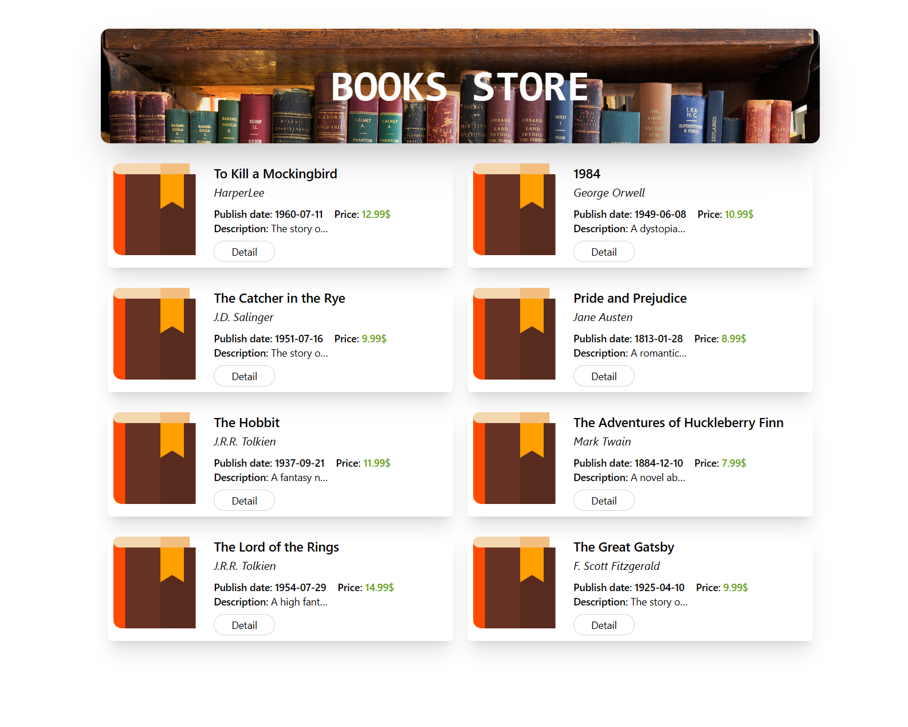

# BUILD A WEBPAGE BOOK STORE WITH REACTJS, FASTIFY AND ELASTICSEARCH

## Prerequisite
Need install Docker and docker compose plugin.
## Usage
I used ReactJS + Vite to build the webpage.

First, run some services such as Nodejsapp, Elasticsearch and Webpage using docker compose
```bash
docker compose up
```
Then, using this command to add dummy data into elasticsearch
```bash
./migrate.sh
```

Finally, access to the webpage by localhost:5173

## Demo
#### Main page

#### Comment section


## Note
All input element in my webpage is use enter key down to accept and process value from input. So if you want to comment or reply, just typing and then press enter, if you want to hide the input element, click again the button which open input to hide that input.